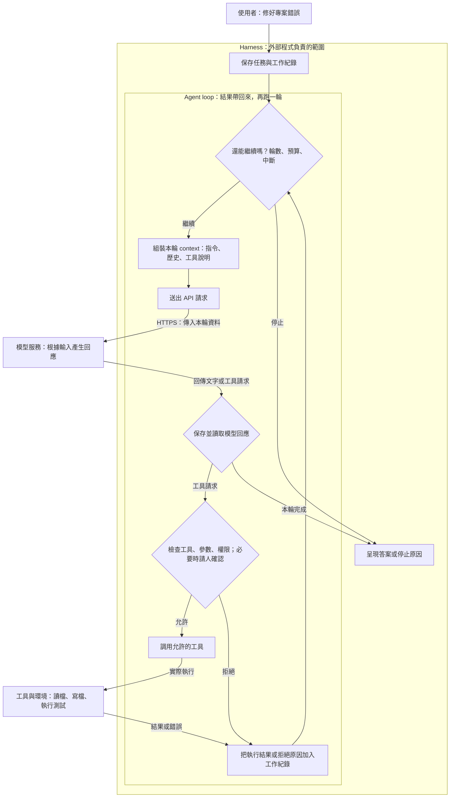

# 什麼是 Agent Harness？

> **你使用的 Agent 是一整套服務。Harness 是其中安排模型輸入、接住模型回應、調用工具並管理執行流程的程式。**
>
> 看懂這條分界，就能理解：為什麼模型能操作檔案、為什麼程式能阻擋它，以及 context engineering 發生在哪裡。

## 你可能帶著什麼問題進來？

你用過 Cursor 這類 Agent：交代任務，它就讀取本機檔案、寫程式、執行指令。你知道它會使用 bash，也知道對話紀錄可以存成 JSON Lines。

但從使用者的角度，這些都是同一個「它」在做。因此，你可能把背後的能力都歸在 LLM 身上。

直到有人說：

> 「重要的限制不能只寫在 Markdown 裡，要用程式阻擋。」

你開始困惑：**如果操作電腦本來就是它的能力，另一段程式要從哪裡介入？又憑什麼擋得住？**

這份 README 就從這個問題出發。不需要先懂 Python；我們用同一個任務——「請幫我修好這個專案的錯誤」——把整個過程拆開，最後再對照一個小型開源實作。

閱讀路線：

1. [我用的 Agent，裡面有哪些東西？](#service)
2. [把一次模型呼叫放大來看](#api)
3. [從一次呼叫，變成持續做事](#loop)
4. [為什麼程式擋得住，Markdown 卻不保證？](#control)
5. [每一輪，模型到底看見什麼？](#context)
6. [回頭看一個真實 harness](#example)

## 1. 我用的 Agent，裡面有哪些東西？

「幫我修好程式」看起來是一個能力，拆開後卻有不同分工：

| 發生的事 | 主要由誰負責？ |
|---|---|
| 看懂收到的程式、推測原因、產生修改內容 | 模型 |
| 決定這次要送哪些指令、檔案內容和歷史給模型 | Harness |
| 接收模型提出的讀檔、修改、測試請求，檢查後安排執行 | Harness |
| 真正讀取硬碟、寫入檔案、啟動測試程序 | 工具與執行環境 |
| 保存工作紀錄，下次取出來使用 | Harness 搭配記憶體、檔案或資料庫 |

模型會寫 bash 指令，和某個程序真的執行 bash，是兩件事。工具也不限於 bash：讀檔可以由專用函式完成，搜尋可以呼叫外部服務。

**你原本看見的是整套服務的能力；現在要把能力的來源與執行的位置分開。**

本文的 harness 指「讓模型持續執行任務的外部程式」這個職責範圍。它可以很小，也可以分布在本機與雲端的多個服務中。Memory、skills、多 agent 都是可加入的功能，不是每個 harness 的必備清單。

這裡以開源範例解釋共同機制，不主張這就是 Cursor 的內部實作。

## 2. 把一次模型呼叫放大來看

**對呼叫端程式而言，雲端 LLM 是透過 HTTPS API 存取的模型服務。** Endpoint 是接收請求的入口；模型本身是入口後面執行推論的部分。

程式準備輸入、送出請求，再收到回應。先看一輪裡的兩端：

| Harness 傳過去 | 模型服務回傳 |
|---|---|
| 任務：「修好這個專案的錯誤」 | 回答文字，或一個以上的工具請求，也可能兩者都有 |
| 指令與相關對話、已取得的檔案內容 | 例如：「請用 Read 讀取 app.py」 |
| 可用工具的名稱、用途與參數格式 | 請求包含工具名稱與所需參數 |

**收到「請讀取 app.py」時，檔案還沒有因為這個請求就被讀取。** Harness 必須找到對應的工具、安排執行，再把內容交回模型。這是 [client-side tool use 的基本往返流程](https://platform.claude.com/docs/en/agents-and-tools/tool-use/overview)。

工具說明也不等於工具本體。把「Read 可以讀檔」寫進請求，不會讓模型服務直接取得你的硬碟；本機仍需要一段真的能開啟檔案的程式。

現在可以看見第一個介入點：**模型回傳的操作請求是一份資料，程式可以先檢查，再決定怎麼處理。**

> 本文先看由呼叫端執行工具的方式。有些 API 會在服務端代為執行搜尋等工具，那是供應商把工具執行也包進服務；外部操作仍由工具與環境完成。[工具執行位置說明](https://platform.claude.com/docs/en/agents-and-tools/tool-use/overview)

## 3. 從一次呼叫，變成持續做事

你只說一次「修好錯誤」，後面卻可能發生很多輪：

| 輪次 | 模型根據目前資料提出什麼？ | Harness 接著做什麼？ |
|---|---|---|
| 1 | 先讀 app.py | 檢查後調用讀檔工具，把檔案內容加入紀錄 |
| 2 | 看過內容後，提出修改 | 檢查後調用編輯工具，把修改結果加入紀錄 |
| 3 | 執行測試確認 | 檢查後啟動測試，把輸出加入紀錄 |
| 4 | 根據測試結果回報，或提出下一步 | 顯示答案，或繼續下一輪 |

**Agent loop 就是：呼叫模型 → 處理工具請求 → 保存結果 → 再次呼叫模型。** 每輪怎麼做可以由模型判斷；下一輪是否真的發生，則需要程式安排。

下面把 harness 框起來，讓你看見 loop、API、工具與檢查的位置。圖是概念上的完整流程，各實作不一定具備所有檢查。

讀圖時，先找三個位置：

- **送出 API 之前**：決定模型這次看見什麼。
- **收到工具請求之後**：決定動作能否執行。
- **結果回來之後**：保存進度，決定是否進入下一輪。

這三個位置都在外部程式手上。因此，harness 能做 context engineering、執行限制與流程管理。

## 4. 為什麼程式擋得住，Markdown 卻不保證？

繼續剛才的修 bug 任務。假設模型提出：「修改 protected/config.py。」而你設定這個資料夾禁止寫入。

| 規則放在哪裡？ | 實際如何起作用？ | 如果模型仍然提出修改？ |
|---|---|---|
| Markdown 指令 | Harness 讀取文字，讓模型知道「不要改這裡」 | 單靠這段文字，不能保證阻止執行 |
| 執行前的程式檢查 | 收到請求後，檢查目標是否允許修改 | 不調用寫入工具，回傳拒絕原因 |
| 執行環境的權限 | 讓執行工具的帳號或沙箱沒有該處寫入權 | 實際寫入時被環境拒絕 |

**程式能阻擋，是因為操作要經過它掌握的入口。** 它不必讓模型同意規則，才能拒絕執行請求。

被拒絕之後，harness 可以把原因交回模型，讓它改成提出修改建議；也可以依設定停止整個任務。

但限制要覆蓋真正的執行途徑。若只攔住 Edit 工具，卻允許不受限制的 bash 或 Python 寫入相同資料夾，仍可能繞過。因此，工具檢查需要和環境權限配合。

Markdown 仍然有用途：它讓模型提早知道工作規範，減少無效嘗試。**規則寫在哪種檔案裡不是關鍵，關鍵是誰在執行規則。** 如果某個設定檔由程式解析後用來封鎖操作，它也可以成為強制限制的來源。

這裡約束的是「哪些動作會真的發生」。模型是否產生正確答案、是否提出好方案，仍需要另外判斷與驗證。

## 5. 每一輪，模型到底看見什麼？

### 對話存在檔案裡，為什麼還要再傳？

API 不會因為你的電腦有一份 JSON Lines，就自動知道裡面的內容。

在本文範例使用的無狀態 Messages API 裡，呼叫端每次都要提供要延續的對話內容。保存歷史、選出本輪需要的資訊，以及把它送進 API，是不同步驟。[Messages API 的多輪對話說明](https://platform.claude.com/docs/en/build-with-claude/working-with-messages)

先假設沒有裁切或摘要，輸入會這樣累積：

| 呼叫 | 本輪帶入的資料 |
|---|---|
| 第一次 | 指令、工具說明、使用者任務 |
| 第二次 | 前述內容＋模型的讀檔請求＋檔案內容 |
| 第三次 | 前述內容＋模型的修改請求＋修改結果 |
| 第四次 | 前述內容＋模型的測試請求＋測試輸出 |

這裡的 messages 包含使用者訊息、模型回應與工具往返，不只是聊天視窗裡看見的文字。JSON Lines 是一種儲存格式；用 JSON、資料庫或記憶體保存，也能完成這個流程。

有些服務提供保存對話狀態的介面，讓呼叫端帶識別碼接續；那是服務端替你管理部分狀態。本文先採用「呼叫端自己組裝歷史」的方式，把責任看清楚。

### Context engineering 為什麼能用程式做？

歷史會越來越長，而模型每次能接收的內容有限。**存在紀錄裡的全部資料，與這一輪真正送入的 context，可以不同。**

例如，修 bug 已經進到測試階段：

| 已保存的資料 | Harness 可以如何安排本輪輸入？ |
|---|---|
| 最初任務與限制 | 保留，讓模型知道仍要完成什麼 |
| 一大段已結束的探索過程 | 改成摘要，但要承擔遺失細節的可能 |
| 剛取得的測試錯誤 | 保留需要診斷的內容 |
| 專案裡其他不相關檔案 | 先不放入，需要時再讀 |

這就是 context engineering 的具體位置：**在 API 呼叫前，安排這次推論需要的資訊。** 程式可以依規則挑選、裁切，也可以另外呼叫模型協助摘要。

改變輸入，就可能改變模型的判斷與工作表現；這個過程不需要更新模型權重。反過來說，放錯資料或省略關鍵限制，也會讓後續工作變差。

### 既然每次都傳，cache 解決什麼？

上面的四次請求，有很多前綴內容相同。Prompt cache 讓服務端在符合條件時重用這些前綴的計算，減少重複處理，並可能降低費用與延遲。

在本文的 Messages API 用法裡，呼叫端仍傳入完整的本輪請求；服務端辨識可重用的前綴。Cache 不會替你選出重要資訊，也不會把超出 context 容量的內容變得放得下。[Prompt caching 說明](https://platform.claude.com/docs/en/build-with-claude/prompt-caching)

把幾個容易混在一起的概念放回各自的位置：

| 概念 | 解決的問題 |
|---|---|
| 對話／工作紀錄 | 前面發生過什麼，要保存在哪裡？ |
| Context engineering | 這一輪要讓模型看見什麼？ |
| Compaction／摘要 | 歷史太長時，如何縮短並盡量保留重點？ |
| Memory | 哪些資訊值得跨工作階段保存，需要時如何取回？ |
| Skill | 做某類工作時，載入哪些專門指引，必要時搭配腳本等資源？ |
| Prompt cache | 相同輸入前綴，如何減少重複計算？ |

保存過，不代表這一輪已經載入；做了摘要，不代表資訊無損；命中 cache，也不代表模型獲得了長期記憶。

## 6. 回頭看一個真實 harness

現在再看程式，目的只剩一個：確認前面提到的責任，真的各有一段程式在做。

本文採用 [OpenLAIR/nano-claude-code 的固定版本 39fe347](https://github.com/OpenLAIR/nano-claude-code/tree/39fe3470d8379adaee2486f5d06cbf318879d85a) 作為主標本。它是較小型的 agent 實作，但仍包含許多進階功能；第一次只需要看以下位置。

| 概念 | 原始碼裡的位置 | 只需要看懂的事 |
|---|---|---|
| 組裝輸入 | [prompts.py](https://github.com/OpenLAIR/nano-claude-code/blob/39fe3470d8379adaee2486f5d06cbf318879d85a/nano_claw_code/prompts.py) 的 build_system_prompt | 專案資訊、規範等內容，是程式整理後加入的 |
| 模型呼叫與 loop | [agent.py](https://github.com/OpenLAIR/nano-claude-code/blob/39fe3470d8379adaee2486f5d06cbf318879d85a/nano_claw_code/agent.py) 的 run_streaming | 把資料交給 API，接住回應，處理工具，再次呼叫 |
| 執行前確認 | [permissions.py](https://github.com/OpenLAIR/nano-claude-code/blob/39fe3470d8379adaee2486f5d06cbf318879d85a/nano_claw_code/permissions.py) 的 needs_permission | 配合迴圈中的分支，決定要不要取得使用者同意 |
| 實際工具 | [tools_impl.py](https://github.com/OpenLAIR/nano-claude-code/blob/39fe3470d8379adaee2486f5d06cbf318879d85a/nano_claw_code/tools_impl.py) 的 dispatch_tool | 把模型提出的工具名稱，接到真的會執行的功能 |
| 保存對話 | [session.py](https://github.com/OpenLAIR/nano-claude-code/blob/39fe3470d8379adaee2486f5d06cbf318879d85a/nano_claw_code/session.py) 的 save_session | 工作紀錄由程式保存；這個範例使用 JSON 檔案 |

**範例展示的是介入的位置，不保證每條路徑都有相同限制。** 這個固定版本的互動迴圈可以要求確認，也有直接放行的模式；另一個執行入口沒有走同一段確認。詳見[進階附錄](docs/engineering-notes.md)。

所以，讀到一個 permissions.py，還不能判斷整個系統已被限制；要看實際執行時是否經過那段檢查。

## 讀完後，你的 mental map 應該如何改變？

原本你看見：**「我交代 Agent，它就會做。」**

現在你能拆成：

| 部分 | 你能辨認的責任 |
|---|---|
| 模型 | 根據收到的內容理解、推理，產生答案或操作請求 |
| Harness | 安排輸入、處理回應、調用工具、保存進度、管理 loop |
| 工具與環境 | 執行實際操作，並受環境權限約束 |
| 紀錄與儲存 | 保存資訊，讓 harness 在後續取用 |

> **Takeaway：Harness 掌握模型呼叫前後的流程，因此能安排模型看見什麼、讓哪些操作真的發生，以及何時繼續或停止。**

下次看到任何 Agent 服務，可以用三個問題拆解它：

1. 這一輪到底給模型看了什麼？
2. 模型提出操作後，是誰執行、誰把關？
3. 結果如何送回下一輪，又由誰決定停止？

能回答這三題，就已經掌握 harness 的核心，不必先記住每個函式名稱。

## 進階閱讀與來源

- [進階附錄：原始碼、實作取捨與檢查清單](docs/engineering-notes.md)：需要實作時再讀。
- [OpenLAIR/nano-claude-code](https://github.com/OpenLAIR/nano-claude-code)：本文的主標本，程式碼採 MIT 授權。
- [shareAI-lab/learn-claude-code](https://github.com/shareAI-lab/learn-claude-code)：想繼續用實作練習時的延伸材料。
- [Anthropic：工具如何執行](https://platform.claude.com/docs/en/agents-and-tools/tool-use/overview)、[多輪對話](https://platform.claude.com/docs/en/build-with-claude/working-with-messages)、[Prompt caching](https://platform.claude.com/docs/en/build-with-claude/prompt-caching)：API 行為的官方說明。

本文使用「呼叫端組裝歷史、執行工具」的方式建立心智模型。產品可以把部分責任移到服務端；部署位置改變時，仍可用上述三個問題找出責任歸屬。

筆記文字採 CC BY 4.0；引用的原始碼著作權與授權歸各原作者。
